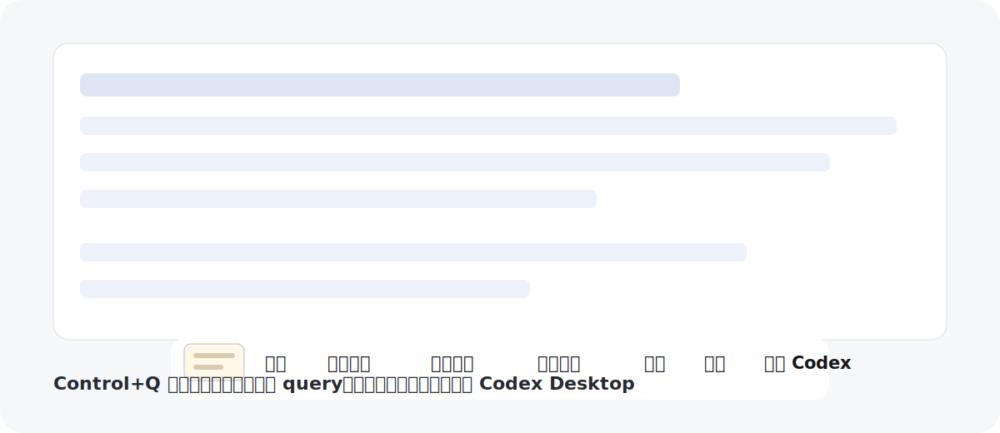

# Codex Screenshot Query

一个 macOS 菜单栏截图助手：按下快捷键截图，选择默认 query，然后把截图和文本直接粘贴到 Codex Desktop。



## 功能特性

- 全局快捷键：`Control+Q`
- 使用 macOS 原生交互式区域截图
- 截图只保存在内存和剪贴板中，不落盘
- 截图后显示轻量浮动操作条
- 内置默认操作：
  - 复制/转写可见文字
  - 提取文字
  - 翻译中文
  - 翻译英文
  - 问问 Codex
- 通过剪贴板和 macOS 自动化，把截图与 prompt 粘贴到 Codex Desktop
- 支持使用 `electron-builder` 打包 DMG

## 使用要求

- macOS
- Node.js 22+
- 已安装 Codex Desktop
- 需要给启动该工具的终端/App 开启“辅助功能”权限，以便通过 System Events 发送 `Cmd+V`

## 本地开发

```bash
npm install
npm start
```

运行检查：

```bash
npm test
npm run build
npm audit --audit-level=moderate
```

## 打包

未签名本地 DMG：

```bash
npm run package:dmg
```

签名并公证的 DMG：

```bash
npm run check:mac-signing
npm run package:dmg:signed
```

证书和公证配置见 [build/README-mac-signing.md](build/README-mac-signing.md)。

## English

Codex Screenshot Query is a small macOS menu bar helper for sending screenshots and preset prompts into Codex Desktop.

### Features

- Global shortcut: `Control+Q`
- macOS interactive area screenshot
- Screenshot is kept in memory and clipboard only; it is not saved locally
- Floating action bar after capture
- Preset actions:
  - Copy/transcribe visible text
  - Extract text
  - Translate to Chinese
  - Translate to English
  - Ask Codex
- Pastes the screenshot and prompt into Codex Desktop via clipboard and macOS automation
- Optional DMG packaging with `electron-builder`

### Requirements

- macOS
- Node.js 22+
- Codex Desktop installed
- Accessibility permission for the terminal/app that launches this helper, so it can send `Cmd+V` through System Events

### Development

```bash
npm install
npm start
```

Run checks:

```bash
npm test
npm run build
npm audit --audit-level=moderate
```

### Packaging

Unsigned local DMG:

```bash
npm run package:dmg
```

Signed and notarized DMG:

```bash
npm run check:mac-signing
npm run package:dmg:signed
```

See [build/README-mac-signing.md](build/README-mac-signing.md) for certificate and notarization setup.

## Notes

This project uses macOS `screencapture`, Electron clipboard APIs, and AppleScript/System Events to paste into Codex Desktop. If automatic paste does not work, grant Accessibility permission in macOS System Settings.

## License

MIT
